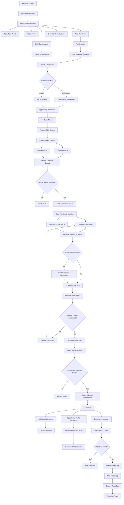

# SpreadSniper

SpreadSniper is an event-driven arbitrage detection and execution platform designed to scan decentralized exchanges for cross-market pricing inefficiencies, evaluate whether those inefficiencies are actually tradable, and distribute validated opportunities to downstream consumers such as notification systems, Redis-backed APIs, and execution strategies.

The application is intentionally split into distinct layers so that new DEXs, chains, markets, execution methods, and consumers can be added without rewriting the entire system.

At a high level, SpreadSniper follows this flow:

```text
Blockchain
   ↓
Pool Discovery
   ↓
DEX Quoters
   ↓
Market Prefilter
   ↓
Trade Size Optimization
   ↓
Round-Trip Simulation
   ↓
ArbitrageOpportunity
   ↓
Event Bus
   ├── Notifications
   ├── Redis Cache / API
   └── Execution
```

---

## What Problem SpreadSniper Solves

A simple arbitrage scanner might look at two DEX prices and say:

```text
Aerodrome:
1 WETH = $2,450

Uniswap:
1 WETH = $2,460
```

and conclude that there is a `$10` arbitrage.

SpreadSniper goes further.

Instead of only comparing prices, it asks:

> **If I actually perform both trades, how much of my original asset do I end up with?**

For example:

```text
1 WETH
   ↓
Aerodrome
   ↓
2,450 USDC
   ↓
Uniswap
   ↓
0.996 WETH
```

Even though there was a visible price difference, that trade is not profitable.

This round-trip approach helps account for:

- Actual pool pricing
- DEX fees embedded in router quotes
- Price impact
- Liquidity depth
- Trade size
- Gas costs

That distinction is important because many apparent arbitrage opportunities disappear once the complete trade path is simulated.

---

# Architecture

## Configuration

Application configuration is centralized in `AppConfig`.

It controls things such as:

- RPC endpoints
- WebSocket mode
- Polling intervals
- Trade sizes
- Probe sizes
- Profit thresholds
- Gas assumptions
- Redis configuration
- Price-impact limits
- Execution safety settings

Environment variables are preferred so behavior can be changed without rebuilding the application.

Conceptually:

```text
.env
 ↓
AppConfig
 ↓
Application
```

---

## Blockchain Connectivity

`Web3Utils` provides blockchain access for supported chains.

The application has a chain model similar to:

```text
Ethereum
Base
Arbitrum
```

The chain abstraction allows infrastructure components to request the appropriate `Web3j` instance without needing to know RPC configuration details.

---

## Token Registry

Tokens are modeled explicitly rather than passing addresses throughout the application.

A token contains information such as:

```text
symbol
address
decimals
chain
```

For example:

```text
WETH_BASE
USDC_BASE
CBETH_BASE
AERO_BASE
```

This is especially important when converting human amounts like:

```text
0.01 WETH
```

into raw blockchain units:

```text
10000000000000000
```

or:

```text
10 USDC
```

into:

```text
10000000
```

The token model prevents decimal mistakes from leaking into the trading logic.

---

# DEX Configuration

`DexConfigurations` contains DEX-level infrastructure information.

For example:

```text
Aerodrome
    router
    factory

Uniswap
    router
    factory
```

This information is infrastructure configuration rather than domain-market information.

The DEX enum itself stays intentionally small:

```text
AERODROME
UNISWAP
```

The DEX does not contain token paths or arbitrage direction.

---

# Pool Discovery

SpreadSniper discovers pools through `PoolResolver` implementations.

For example:

```text
PoolResolver
    ├── AerodromePoolResolver
    └── UniV2PoolResolver
```

Each resolver understands how its DEX discovers pools.

A Uniswap V2-style resolver might call:

```text
factory.getPair(tokenA, tokenB)
```

while an Aerodrome resolver can resolve stable and volatile pools separately.

Resolved pools are stored in `PoolRegistry`.

A `Pool` represents something like:

```text
DEX
chain
token0
token1
pool address
stable / volatile metadata
```

This means the application no longer thinks merely in terms of:

```text
Aerodrome WETH/USDC
```

but instead:

```text
this exact Aerodrome WETH/USDC pool
```

---

# Routes and Markets

A `DexRoute` represents a specific trading direction through a specific pool.

For example:

```text
Aerodrome Pool
WETH → USDC
```

A route can also be reversed:

```text
USDC → WETH
```

A `DexPair` represents two routes that SpreadSniper should compare.

For example:

```text
Aerodrome WETH/USDC
        VS
Uniswap WETH/USDC
```

Importantly, the pair does **not** assume which DEX is the buy side or sell side.

Direction is discovered dynamically.

---

# DEX Quoters

Each supported DEX implements the same `DexQuoter` interface.

Conceptually:

```kotlin
interface DexQuoter {

    val dex: Dex

    fun quote(
        web3: Web3j,
        route: DexRoute,
        amountIn: BigInteger,
        block: DefaultBlockParameter
    ): BigInteger?
}
```

The implementation can be completely different internally.

Aerodrome may encode:

```text
amountIn
+
AeroRoute struct[]
```

while Uniswap V2 may encode:

```text
amountIn
+
address[] path
```

The rest of SpreadSniper doesn't care.

It only asks:

> **Given this route and this amount, how much output do I receive?**

That makes adding additional DEX implementations much easier.

---

# Opportunity Detection

The opportunity layer examines configured markets every polling interval or new block.

The scanner first performs a cheap prefilter.

For example:

```text
Aerodrome quote
        ↓
     compare
        ↑
Uniswap quote
```

If the spread is below the configured threshold, the market is skipped immediately.

This prevents SpreadSniper from performing expensive round-trip simulations on markets where both DEXs are already priced almost identically.

---

# Trade Size Optimization

If a market passes the prefilter, SpreadSniper begins evaluating trade sizes.

For example:

```text
0.001
0.005
0.01
0.025
0.05
0.1
0.25
0.5
1.0
```

These are human-readable amounts and are converted into raw token units based on token decimals.

For every size, both arbitrage directions can be tested:

```text
DEX A → DEX B
```

and:

```text
DEX B → DEX A
```

The output of the first trade becomes the exact input of the second trade.

For example:

```text
0.01 WETH
     ↓
Aerodrome
     ↓
24.55 USDC
     ↓
Uniswap
     ↓
0.00997 WETH
```

The round-trip result is then compared with the initial input amount.

---

# Liquidity and Price Impact

SpreadSniper also compares larger trades against a small baseline quote.

If execution quality deteriorates beyond the configured price-impact threshold, the scanner stops trying larger sizes.

For example:

```text
0.001 WETH   healthy
0.005 WETH   healthy
0.01 WETH    healthy
0.025 WETH   acceptable
0.05 WETH    180 bps impact
              ↓
            STOP
```

This prevents the scanner from wasting RPC requests testing obviously unusable trade sizes.

It also protects the system from being fooled by large apparent price discrepancies caused by extremely shallow pools.

---

# Arbitrage Opportunity

Once a profitable round trip is found, it becomes an `ArbitrageOpportunity`.

Rather than storing ambiguous fields such as:

```text
buyDex
sellDex
```

the opportunity contains actual trade legs.

Conceptually:

```text
ArbitrageOpportunity
    │
    ├── FirstLeg
    │      DEX
    │      tokenIn
    │      tokenOut
    │      amountIn
    │      amountOut
    │
    └── SecondLeg
           DEX
           tokenIn
           tokenOut
           amountIn
           amountOut
```

That means downstream systems receive an explicit executable route.

---

# Event-Driven Distribution

Once an opportunity is selected, it is distributed through the application's `EventBus`.

Consumers are independent of the detection logic.

Conceptually:

```text
ArbitrageOpportunity
        ↓
      EventBus
   ┌──────┼──────┐
   ↓      ↓      ↓
Notify   Redis  Execute
```

This design makes the application easy to extend.

Detection does not need to know how Discord works.

Redis does not need to know how arbitrage detection works.

The executor does not need to know how notifications work.

Each component reacts to events that matter to it.

---

# Redis

Redis currently serves two important purposes.

## Opportunity Cache

The opportunity cache stores recent opportunities in a serialized DTO format that can eventually be consumed by an API or other external service.

Conceptually:

```text
ArbitrageOpportunity
        ↓
RedisOpportunityDto
        ↓
Redis
        ↓
API / External Consumer
```

## Execution Idempotency

The execution idempotency store prevents the same opportunity from being executed multiple times.

An opportunity receives a deterministic key based on properties such as:

```text
chain
block
route
tokens
trade amount
```

The executor attempts an atomic Redis claim before execution.

Conceptually:

```text
Opportunity
     ↓
SET key PROCESSING NX
     ↓
 ┌───┴───┐
 │       │
OK      Exists
 │       │
Execute  Skip
```

---

# Execution

Execution is abstracted behind an `ArbitrageExecutionStrategy`.

That allows SpreadSniper to support multiple execution methods.

For example:

```text
ArbitrageExecutionStrategy
        │
        ├── WalletFundedExecution
        │
        └── FlashLoanExecution
```

The current strategy can execute the opportunity's first and second trade legs.

Long term, atomic execution is preferable because executing two independent transactions introduces risk between the first and second trade.

An atomic execution flow could eventually look like:

```text
Single Transaction
        ↓
Obtain Capital
        ↓
DEX Swap A
        ↓
DEX Swap B
        ↓
Verify Profit
        ↓
Repay Capital
        ↓
Keep Profit
```

If the trade becomes unprofitable:

```text
Trade Fails Profit Check
        ↓
Revert Entire Transaction
```

---

# Current Data Flow



---

# How to Add to SpreadSniper

SpreadSniper is designed so contributors can extend individual pieces without understanding or modifying the entire application.

A good first question when adding functionality is:

> **What kind of thing am I adding?**

---

## 1. Adding a Token

Register the token with its:

- Chain
- Address
- Symbol
- Decimals

For example:

```kotlin
val NEW_TOKEN_BASE = Token(
    symbol = "TOKEN",
    address = "0x...",
    decimals = 18,
    chain = Chain.BASE
)
```

Once registered, pools and routes can reference the token without passing raw addresses throughout the application.

### Checklist

- [ ] Add token to the token registry
- [ ] Verify address
- [ ] Verify decimals
- [ ] Associate it with the correct chain
- [ ] Add pools containing the token if needed
- [ ] Add markets containing the token if needed

---

## 2. Adding a Market

A market represents two DEX routes that should be compared.

For example:

```text
Aerodrome WETH/USDC
        VS
Uniswap WETH/USDC
```

Create a `DexPair` containing the two routes:

```kotlin
DexPair(
    routeA = DexRoute(
        pool = randomPoolAddress,
        tokenIn = Tokens.WETH_BASE,
        tokenOut = Tokens.USDC_BASE
    ),
    routeB = DexRoute(
        pool = randomPoolAddress,
        tokenIn = Tokens.WETH_BASE,
        tokenOut = Tokens.USDC_BASE
    ),
    label = "Aerodrome vs Uniswap WETH/USDC"
)
```

Then add the market to the collection scanned by the application.

### Checklist

- [ ] Both tokens registered
- [ ] Pool exists on DEX A
- [ ] Pool exists on DEX B
- [ ] Routes use the same input/output tokens
- [ ] Add `DexPair`
- [ ] Register the pair with the scanner

---

## 3. Adding a Pool

Pools should preferably be discovered through a `PoolResolver`.

Conceptually:

```text
PoolResolver
      ↓
DEX Factory
      ↓
Pool Address
      ↓
PoolRegistry
```

If the DEX exposes reliable factory-based discovery, prefer that over hardcoding pool addresses.

### Checklist

- [ ] Determine how the DEX discovers pools
- [ ] Implement or extend its `PoolResolver`
- [ ] Resolve the pool address
- [ ] Add DEX-specific metadata if required
- [ ] Register the resolved pool

---

## 4. Adding a New DEX

Adding a DEX generally requires several small integrations rather than changes to the arbitrage engine itself.

### Step 1 — Add the DEX

```kotlin
enum class Dex {
    AERODROME,
    UNISWAP,
    NEW_DEX
}
```

### Step 2 — Add Configuration

Register things such as:

```text
router
factory
chain
```

### Step 3 — Implement Pool Discovery

```text
PoolResolver
    ↓
NewDexPoolResolver
```

The resolver should know how to locate pools for that protocol.

### Step 4 — Implement `DexQuoter`

```kotlin
class NewDexQuoterService(
    parameterName: ParameterName
) : DexQuoter {

    override val dex =
        Dex.NEW_DEX

    override fun quote(
        web3: Web3j,
        route: DexRoute,
        amountIn: BigInteger,
        block: DefaultBlockParameter
    ): BigInteger? {
        // DEX-specific quote implementation
    }
}
```

### Step 5 — Register the Quoter

Add the implementation to the application's quoter configuration.

The opportunity engine should then be able to interact with the new DEX through the same abstraction used by existing DEXs.

### Checklist

- [ ] Add `Dex`
- [ ] Add router/factory configuration
- [ ] Add `PoolResolver`
- [ ] Add `DexQuoter`
- [ ] Register resolver
- [ ] Register quoter
- [ ] Discover pools
- [ ] Create markets

---

## 5. Adding Another Chain

Adding another chain should primarily involve configuration and registry additions.

For example:

```kotlin
enum class Chain {
    ETHEREUM,
    BASE,
    ARBITRUM
}
```

Then configure:

```text
RPC
WebSocket RPC
Tokens
DEX deployments
Pools
Markets
```

### Checklist

- [ ] Register chain
- [ ] Configure RPC
- [ ] Configure WebSocket RPC if supported
- [ ] Register chain-specific tokens
- [ ] Register DEX deployments
- [ ] Discover pools
- [ ] Create markets
- [ ] Verify gas estimation

---

## 6. Adding a Notification Channel

Notifications should consume opportunity events rather than modifying opportunity detection.

For example:

```text
EventBus
   │
   ├── Discord
   ├── Telegram
   ├── Slack
   └── Email
```

A new notification service simply subscribes to the appropriate event.

### Checklist

- [ ] Create notification service
- [ ] Subscribe to opportunity event
- [ ] Format message
- [ ] Configure credentials/webhook
- [ ] Handle delivery failures

---

## 7. Adding Another Storage System

Storage should sit behind repository abstractions.

For example:

```text
OpportunityRepository
       │
       ├── RedisOpportunityRepository
       └── PostgresOpportunityRepository
```

Redis can remain the low-latency cache while PostgreSQL stores historical data for analytics.

### Checklist

- [ ] Implement repository interface
- [ ] Serialize domain model appropriately
- [ ] Subscribe storage consumer to events
- [ ] Configure connection
- [ ] Add error handling

---

## 8. Adding Another Execution Method

Execution is abstracted behind:

```text
ArbitrageExecutionStrategy
```

That allows multiple implementations:

```text
ArbitrageExecutionStrategy
        │
        ├── WalletFundedExecution
        │
        ├── FlashLoanExecution
        │
        └── FutureStrategy
```

A strategy receives an `ArbitrageOpportunity` containing the exact trade legs that should be executed.

### Checklist

- [ ] Implement `ArbitrageExecutionStrategy`
- [ ] Resolve routers
- [ ] Encode swaps
- [ ] Add slippage protection
- [ ] Add idempotency protection
- [ ] Handle failures
- [ ] Register strategy
- [ ] Test in dry-run mode
- [ ] Test against fork/test environment before live execution

---

## 9. Adding an API or External Consumer

External consumers should generally consume stored opportunity information rather than becoming coupled directly to the scanner.

Conceptually:

```text
Scanner
   ↓
EventBus
   ↓
Redis
   ↓
API
   ↓
External Consumer
```

This keeps detection latency independent from API traffic.

Possible consumers include:

- Dashboards
- Trading tools
- Analytics systems
- Opportunity feeds
- Other bots

---

## 10. Improving the Scanner

Scanner-specific algorithms should eventually live behind a dedicated service such as:

```text
TradeSizeOptimizer
```

rather than continuing to expand `OpportunityOrchestrator`.

That service can own functionality such as:

```text
Market Probe
     ↓
Prefilter
     ↓
Baseline Quote
     ↓
Trade Size Search
     ↓
Price Impact Analysis
     ↓
Round-Trip Simulation
     ↓
Best Trade Size
```

Potential improvements include:

- Coarse-to-fine sizing
- Binary-search sizing
- Dynamic probe sizes
- Dynamic spread thresholds
- Liquidity scoring
- Historical opportunity scoring
- Pool prioritization
- RPC request reduction
- Concurrent market scanning
- Multi-hop routing

---

# Design Principles

The main architectural principle of SpreadSniper is:

```text
Discover
   ↓
Evaluate
   ↓
Publish
   ↓
React
```

Components should generally avoid reaching across these boundaries.

A DEX quoter should **not** send Discord messages.

A notification service should **not** calculate arbitrage profitability.

An executor should **not** discover pools.

A pool resolver should **not** decide trade sizes.

Redis should **not** contain trading logic.

The more those responsibilities remain separated, the easier SpreadSniper becomes to extend.

---

# Where Does New Code Belong?

For someone new to the repository, use this mental model:

```text
What am I adding?
        │
        ├── Blockchain integration?
        │       ↓
        │   infrastructure
        │
        ├── Trading concept/model?
        │       ↓
        │     domain
        │
        ├── Application behavior/orchestration?
        │       ↓
        │   application
        │
        ├── Reaction to an opportunity?
        │       ↓
        │   event consumer
        │
        └── External system integration?
                ↓
           infrastructure
```

Or, more simply:

| Concern | Layer |
|---|---|
| Tokens, DEXs, opportunities, routes | `domain` |
| Opportunity processing and orchestration | `application` |
| Blockchain RPC | `infrastructure` |
| DEX implementations | `infrastructure` |
| Pool discovery | `infrastructure` |
| Redis | `infrastructure` |
| Trade execution | `infrastructure` / strategy |
| Notifications | `infrastructure` |
| Environment configuration | `configurations` |

---

# Contributor Rule of Thumb

Before adding code, ask:

> **Can this feature be added by implementing an existing interface?**

If yes, prefer that over modifying the core opportunity engine.

For example:

```text
New DEX
    → implement DexQuoter + PoolResolver

New execution mechanism
    → implement ArbitrageExecutionStrategy

New persistence mechanism
    → implement repository

New notification mechanism
    → add event consumer
```

Ideally, adding a new integration looks like:

```text
Implement
    ↓
Configure
    ↓
Register
    ↓
Run
```

rather than:

```text
Modify scanner
    ↓
Modify orchestrator
    ↓
Modify executor
    ↓
Modify everything else
```

That separation is what allows SpreadSniper to grow from a two-DEX arbitrage scanner into a broader multi-chain, multi-DEX trading platform without requiring the core architecture to be rewritten.